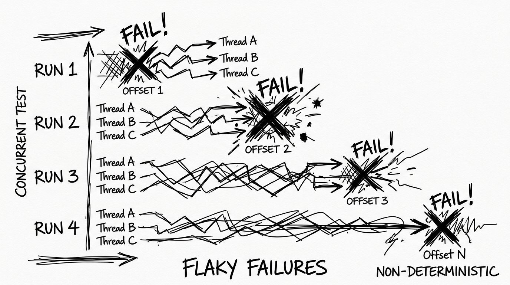
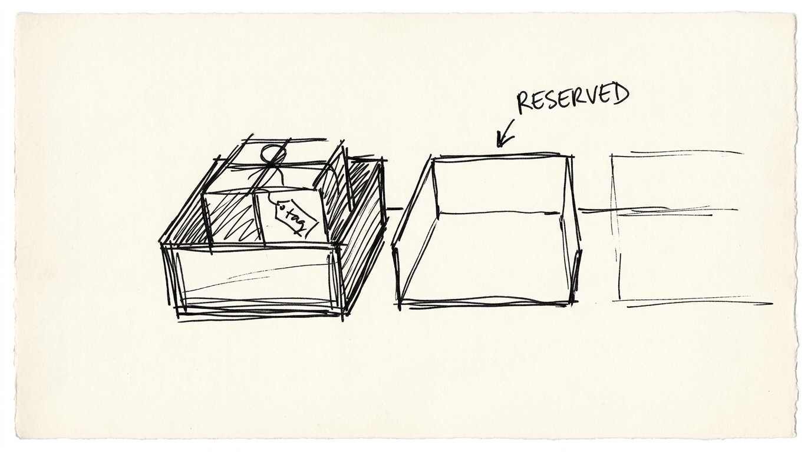
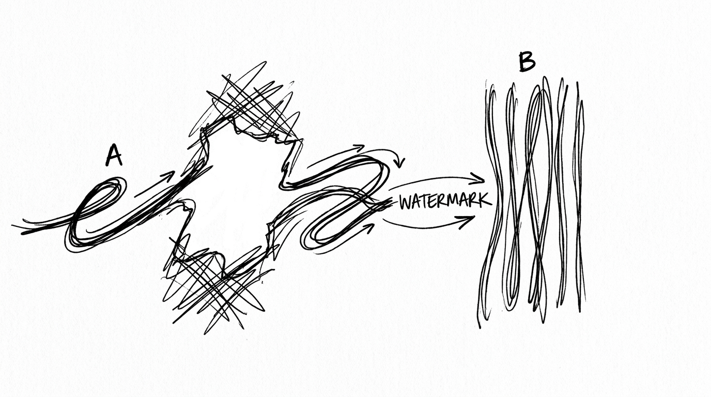
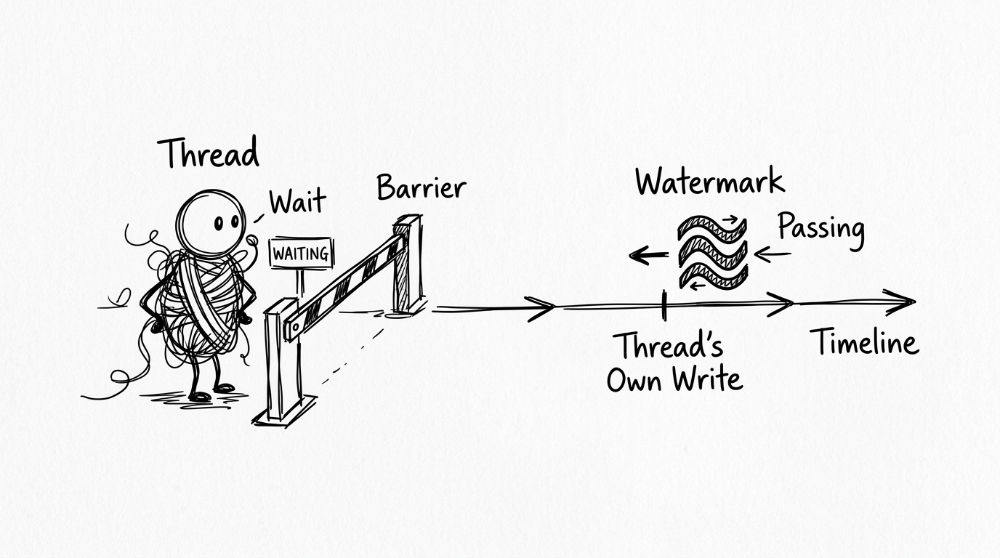
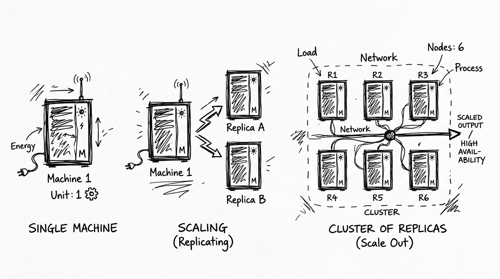

# 1 Million Messages, 100 Threads, One Bug at Offset 970,898



At the end of the last post, I told you I had built something that felt bulletproof. Append-only durability. CRC32 on every record. A sparse index. Concurrent writes with no lock on the byte-copying path. So I did the only responsible thing: I pointed 100 threads at it and told them to write one million messages.

It passed.

I ran it again, because I don't trust a green test I haven't earned. It failed at offset **970,898**.

I ran it a third time. It failed at a *different* offset.

Let me be precise about why that third run is the scariest sentence in this entire series. A test that fails is information. A test that fails **in a different place every time** is telling you two things at once: the bug is real, and the bug is *timing*. It is not a logic error you can find by staring at the code, because the code is correct on paper. It only becomes wrong when 100 real threads hit a real scheduler on a real machine, and which run exposes it depends entirely on how the OS decided to interleave them that microsecond.

I had shipped this bug into two blog posts' worth of confidence. This is the post where I hunt it down.

---

## Section 1: The Lie Hiding in `writePosition`

The bug lives inside a design decision I was *proud* of.

In the last post I made a whole thing of the "two counters" insight: `writePosition` tracks physical bytes, `messageCount` tracks logical offsets, and you must never conflate them. That's true. But I had smuggled in a much more dangerous assumption without ever writing it down: **that `writePosition` tells you how far the data has actually been written.**

It doesn't. It tells you how far the data has been **claimed**.

Look at what an `append()` actually does, in two distinct steps:

1. **The claim.** In one short atomic step, the thread reads the current write position, computes where its record ends, advances `writePosition` to that end, and grabs its logical offset. When this step finishes, the thread *owns* a byte range — say `[1000, 1100)`. Nobody else can touch it.
2. **The fill.** *Then*, separately, the thread duplicates the buffer, seeks to position 1000, and copies its length prefix, payload, and CRC into that range.

Step 1 and step 2 are not the same instant. They are two moments with a gap between them, and the OS scheduler is allowed to park the thread anywhere inside that gap — including right after the claim, before a single payload byte is written.

So `writePosition` is a **promise**, not a fact. It says "bytes up to here have been *claimed*." It says nothing about whether they've been *filled*.

And my consumer was reading up to `writePosition`.

---

## Section 2: The Hole, Traced Byte by Byte



Here's the trace I should have done on a whiteboard before I ever wrote the read path. Two threads, one segment, `writePosition` sitting at 1000.

- **Thread A** claims `[1000, 1100)`. `writePosition → 1100`. A now owns those bytes but has written *nothing* into them yet.
- **Thread B** claims `[1100, 1200)`. `writePosition → 1200`.
- **Thread B fills first.** It copies its length, payload, and CRC into `[1100, 1200)`. Done and correct.
- **Thread A is still parked.** The scheduler hasn't given it CPU time yet. `[1000, 1100)` is claimed but physically still whatever was sitting in that memory — uninitialized zeros, or worse, stale bytes from a previous mapping.
- Now a **consumer** reads. Its boundary is `writePosition = 1200`, so it believes messages exist all the way to 1200. It seeks to offset 1000 and reads.

There it is. A claimed-but-empty slot sitting *behind* a fully-written one. The threads finished out of order, and the read boundary trusted the claim frontier.

What the consumer gets depends entirely on the garbage in that slot:

- If the length-prefix bytes happen to be zero, it reads a zero-length message, and every offset after it silently desyncs — the exact silent-corruption failure I swore CRC had killed forever.
- If the length-prefix bytes are non-zero garbage, CRC catches it and throws. But that is a **false alarm** — the data at offset 1000 was going to be perfectly valid a few microseconds later. I'd be throwing a corruption error on healthy data purely because a reader raced a writer.

Both roads lead back to one sentence, which I wrote on a sticky note and left on my monitor for the rest of the project:

> **`writePosition` is the *claimed* frontier. What a consumer is allowed to see is the *committed* frontier. They are not the same number, and this entire bug is the code pretending they are.**

---

## Section 3: Three Frontiers, Not Two

Last post I said there were two counters. There are actually three *frontiers*, and I'd only been respecting two of them.

1. **The claimed frontier** — `writePosition`. How far bytes have been reserved. Moves the instant a claim succeeds, in any order relative to filling.
2. **The offset counter** — `messageCount`. The logical ID stream. It also increments on the *claim*, which means it is a "claimed" quantity too. Never treat `messageCount` as "how many messages are safely readable." That was a related trap I had to dig out separately.
3. **The committed frontier** — the **High Watermark**. The one I was missing entirely.

The definition is deceptively small, and the small word is the whole thing:

> **The High Watermark is the highest byte position `H` such that every record below `H` has been completely written — with no holes.**

*No holes* is the load-bearing phrase. It is not "the highest position anyone has finished writing." Thread B finishing `[1100, 1200)` does **not** entitle the watermark to jump to 1200, because `[1000, 1100)` is still a crater. The watermark can only crawl forward across a *contiguous* run of finished slots, starting from where it currently sits. A single unfinished slot pins it in place — which is exactly, precisely correct, because that unfinished slot *is* the hole, and the watermark's entire job in life is to sit behind it until it fills.

Consumers read up to the High Watermark and never one byte past it. The hole doesn't become unlikely to read. It becomes **structurally unreachable.**

---

## Section 4: Cooperative Advancement — How the Watermark Crawls



The hard part is: how does the watermark actually move, when threads finish in a scrambled order?

The design I landed on uses a map of finished-but-not-yet-covered slots, keyed by their byte position:

```java
private final AtomicLong highWatermark = new AtomicLong(0);
private final ConcurrentMap<Long, Integer> pendingAppends = new ConcurrentHashMap<>();
```

The critical detail — and the one I got wrong in my own head three weeks later — is *when* a thread writes to this map. It is **after** the fill, not at the claim. A thread only announces itself here once its bytes are physically on the page. So `pendingAppends` isn't "reservations in flight." It's "**completed writes waiting to be folded into the watermark.**"

Then the thread tries to advance the watermark:

```java
pendingAppends.put(claimedWritePos, totalBytes);
while (true) {
    long currentHwm = highWatermark.get();
    Integer length = pendingAppends.get(currentHwm);
    if (length != null) {
        if (highWatermark.compareAndSet(currentHwm, currentHwm + length)) {
            pendingAppends.remove(currentHwm);
        }
    } else {
        break;
    }
}
```

Read what this loop actually does. It looks at the finished slot sitting *exactly at the current watermark position*. If there is one, it CAS-jumps the watermark forward by that slot's length and drops the entry. Then it looks again. It keeps walking forward across finished, contiguous slots until it hits a position where nothing has landed yet — the next real hole — and stops.

The word "cooperative" is the whole idea. Walk the two-thread trace again with this loop running:

- Watermark sits at 1000. Thread A's slot `[1000, 1100)` is still empty — A is parked.
- **Thread B** fills `[1100, 1200)`, puts `{1100 → 100}`, and runs the loop. It reads the watermark (1000), asks `pendingAppends.get(1000)` → nothing there (A hasn't landed), and breaks. The watermark doesn't move. B's finished slot just sits in the map at 1100, waiting.
- Later, **Thread A** wakes, fills `[1000, 1100)`, puts `{1000 → 100}`, and runs the loop. Now `get(1000)` → 100. CAS the watermark 1000 → 1100, remove. Look again: `get(1100)` → 100 — *that's B's slot, the one that was parked in the map*. CAS 1100 → 1200, remove. Look again: `get(1200)` → nothing. Stop.

Thread A, by filling the *earliest* gap, dragged the watermark across its own slot **and** across B's slot in a single pass. B did all the work of writing its bytes and then could do nothing with them; A's arrival paid it forward. Whoever fills the earliest hole sweeps the watermark past everyone who finished early and was stuck waiting behind them.

No coordinator thread. No global commit lock. The hot path stays free, and the watermark still moves correctly no matter how badly the scheduler scrambles the finish order.

---

## Section 5: The Barrier — Making `append()` Return a Promise You Can Cash



There was one more gap, and it's the piece that finally turned the flaky test deterministically green. It's also the piece I'm least proud of, and I'm going to be honest about why.

The cooperative loop advances the watermark *as far as it can right now*. But a thread can finish its own write while an earlier hole still exists — its slot lands in the map, uncovered, waiting for someone else to fill the gap below it. If `append()` returned at that moment, it would hand the caller back an offset that **isn't committed yet.** The caller reads its own write back immediately, hits the not-yet-committed boundary, and gets an error for data it just successfully wrote. Read-your-own-writes, broken.

So `append()` doesn't return after the sweep. It waits at a barrier:

```java
long requiredHWM = claimedWritePos + totalBytes;
while (this.highWatermark.get() < requiredHWM) {
    LockSupport.parkNanos(1);
}
return claimedLogicalOffset;
```

The thread parks a nanosecond at a time until the watermark has swept past the end of *its own* slot. Only then does it return its offset. That gives `append()` a real contract: **when it hands you an offset, that offset is committed and readable — not reserved, not pending, actually there.** The promise you get back is one you can cash immediately.

Here's the honest part. `parkNanos(1)` in a loop is a spin, and this entire engine is a crusade against spinning. This is the *correct* version, not the *optimal* one. The clean version — the LMAX Disruptor sequencer pattern — replaces the map-walk-and-spin with a completion bitset: one bit per slot, flipped on completion, and a wait-free way to find the committed frontier without ever busy-waiting. I know exactly what replaces this loop and why. I deliberately shipped the spinning version first, because it is provably correct and I wanted correctness nailed down before I optimized it away. Choosing the slower-but-correct primitive on purpose, and knowing precisely what the fast one looks like, is a different thing from not knowing better.

---

## Section 6: The Read Side — One Number Guards Everything

With the watermark crawling correctly, the read path gets almost boring, which is the goal. When a consumer reads, the segment finds the record's physical position, reads its length, computes where the record ends, and checks it against the watermark:

```java
long messageEndPos = pos + 16 + length;
if (messageEndPos > highWatermark.get()) {
    throw new OffsetOutOfRangeException("Message not yet committed");
}
```

If the record ends beyond the committed frontier, it does not exist as far as any reader is concerned. Not "probably corrupt" — *not committed.* The hole can't be read because the watermark provably sits behind it. And because the watermark only ever advances across fully-written contiguous slots, `messageEndPos ≤ highWatermark` is an ironclad guarantee that those bytes are real. One number, checked once, closes the entire race.

That same number does a second job I didn't expect. When a consumer catches up to the frontier and there's nothing new to read, it shouldn't spin — it should sleep until a producer advances the watermark, then wake. So the watermark isn't only a safety boundary; it's the *signal*. On the write side, a producer that moves the frontier forward wakes any parked consumers — but only pays that cost when someone is actually waiting for it:

```java
if (waitingConsumers.get() > 0) {
    newDataLock.lock();
    try {
        newDataCondition.signalAll();
    } finally {
        newDataLock.unlock();
    }
}
```

The number that hides the hole is the same event that means "new committed data exists — wake up." Safety frontier and liveness signal, one concept doing both jobs. That's usually the sign a design is sitting on something real rather than bolted together.

---

## Section 7: The Proof

The test that started this whole nightmare is also the proof it's fixed. One hundred threads, ten thousand messages each, all released at once through a `CyclicBarrier` for maximum contention. Then, after every writer has finished, it reads back **every single offset** and demands an exact byte-for-byte match:

```java
for (long offset = 0; offset < totalMessages; offset++) {
    byte[] retrieved = log.read(offset);
    assertArrayEquals(payload, retrieved, "Payload corrupted at offset: " + offset);
}
```

That `assertArrayEquals` is the trap. A hole reads back as zeros, zeros don't match the payload, and the assertion fails — at whatever offset the scheduler happened to leave a crater on that particular run. 970,898 one time, somewhere else the next. That's the flakiness: not randomness in the bug, but randomness in *where the scheduler parked a thread.*

With the committed frontier in place, there is no offset a reader can reach that isn't fully written. The craters are structurally unreachable. The test stopped being flaky because the bug stopped being possible, not because I got lucky on the retries.

---

## Closing: Claimed Is Not Committed



If I had to compress this entire post into one line I'd put on a whiteboard, it's this:

> **Claimed is not committed.** A reservation is a promise about the future, and you must never let a reader trust a promise. Only expose what is actually, physically, provably there.

What makes this the most important bug in the series isn't the fix. It's that the *idea* doesn't stay on one machine. Every distributed system I'm about to build says this exact sentence in a louder voice. A write isn't real until a quorum of replicas has it. A leader isn't a leader until its term is committed. A transaction isn't durable until it's on disk *and* acknowledged. "Claimed versus committed" is the same crack running through every layer of the stack — I just happened to meet it first here, at offset 970,898, watching a single parked thread turn a "bulletproof" engine into a liar.

The two other lessons that stuck:

**Design by failure beats design by intuition, again.** I did not architect the High Watermark from a textbook. I got hunted into it by a test that refused to fail the same way twice. Every good decision in this engine has been forced by a failure I either watched or reasoned through on a whiteboard.

**Nondeterminism is the real enemy, not corruption.** A crash is honest — it tells you something broke. Silent, scheduler-dependent corruption is the thing that ships to production and detonates at 3 a.m. under load you never tested. Building this taught me to fear the *quiet* failure far more than the loud one.

**Next post:** the question I've been deferring since Project 1 finally gets answered — what happens to all of this when the power cord gets pulled *mid-write*? How the forward-scan plus CRC truncation rebuilds a clean log on boot, and how the watermark itself gets reconstructed from nothing but the bytes on disk.

---

## Reference

- [mini-kafaka storage engine source code](https://github.com/Gowtham-beep/mini-kafaka/tree/main/src/main/java/com/minibroker/log)

