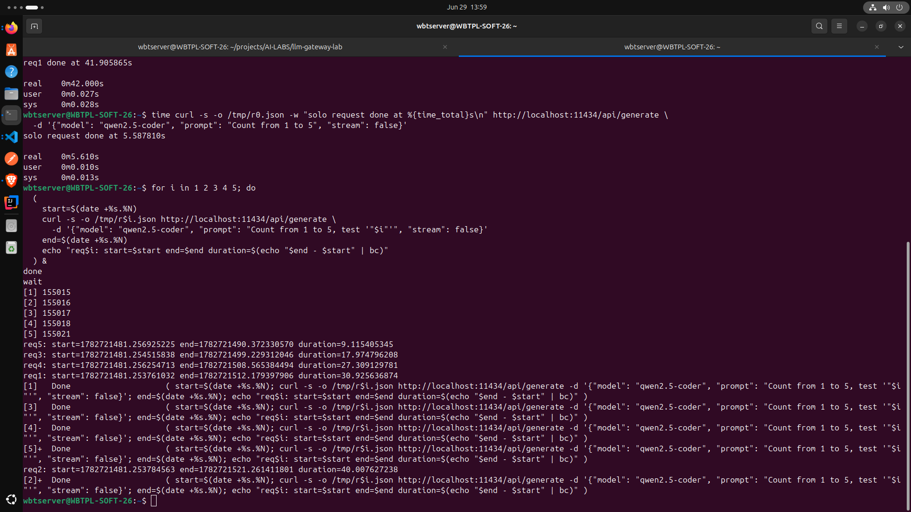
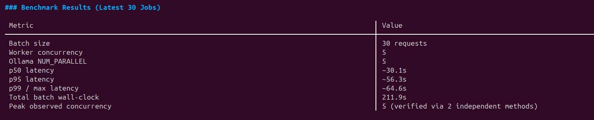

# I Added Concurrency to My LLM Server and Every Request Got Slower (On Purpose)

*AI/MLOps Experiment Lab #1 — building an LLM inference gateway from first principles, one weekend at a time.*

---

## The idea

I work as a backend engineer during the week — Node, Fastify, Postgres, Redis, BullMQ, the usual production stack. On weekends, I run a separate track: **AI/MLOps Experiment Labs**, where I treat LLM inference as a distributed systems problem instead of a prompting problem.

No RAG pipelines, no agent frameworks, no wrapper-around-an-API content. Just the boring, load-bearing infrastructure question that actually shows up in machine-coding interviews and production incidents: **what happens when an unreliable, slow, rate-limited dependency sits behind your API, and a hundred requests show up at once?**

Lab #1 was supposed to be simple: put a queue in front of an LLM, bound the concurrency, measure it. It did not stay simple. By the end of one weekend I had:

- **4 wrong (or unverified) theories** about why my own instrumentation was lying to me
- **3 real, distinct bugs** — one a correctness issue, one an algorithm issue, one a documented library race condition
- **2 fully contaminated test runs** that I had to throw away
- **1 clean, cross-validated benchmark** I'd actually trust enough to publish

Here's the build, the debugging trail, and the numbers — including the headline finding that gives this post its title: adding concurrency made every individual request slower, and that's not a bug.

---

## What I built

The architecture is deliberately boring, which is the point — three cleanly separated layers, the same shape I already use in production:

```
Client → Fastify API → BullMQ Queue → Worker → LLM (Groq / local Ollama)
```

- **API layer** (`src/api`) — Fastify. `POST /infer` enqueues a job and returns a `jobId` immediately. It never waits on the LLM.
- **Queue layer** (`src/queue`) — BullMQ on Redis. Jobs sit here until a worker is free.
- **Worker layer** (`src/worker`) — a separate Node process. Pulls jobs, calls the LLM, writes the result back.
- **LLM client layer** (`src/llm`) — a provider-agnostic interface, so the worker calls `client.complete(prompt)` and has no idea whether that's hitting Groq or a local Ollama instance.

Three LLD patterns I'd only ever used in Java/Spring contexts before this showed up naturally here, in plain TypeScript:

- **Singleton** — the Redis connection (`src/config/redis.ts`) is created once and shared across the API and worker processes. No connection-per-request leakage.
- **Factory** — `getLLMClient(provider: 'groq' | 'ollama')` returns the right client implementation based on an env var, without the worker needing to know which one it got.
- **Strategy** — the `LLMClient` interface itself. `GroqClient` and `OllamaClient` are interchangeable strategies behind one `complete()` contract. Swapping providers means changing an env var, not touching worker logic.

The first thing I verified — before writing a single line of concurrency logic — was that the layers were *actually* decoupled: I killed the worker process entirely, fired a request at the API, and confirmed the job sat patiently in Redis instead of erroring out. Only once that held up did I move on to the part I actually cared about.

---

## The headline finding: parallelism doesn't create compute, it slices it

Before touching BullMQ, I tested the assumption everyone makes about concurrency: *more parallel requests = more throughput.* I ran this directly against my local Ollama server (Qwen2.5-Coder, 4-core machine), bypassing my whole gateway, with raw `curl`:

| Test | Result |
|---|---|
| 1 solo request | **5.6s** |
| 2 requests fired in parallel | 35.4s and 41.9s — roughly the sum of two solo requests, run back to back |
| 5 requests fired in parallel (default config) | A staircase: 9.1s, 18.0s, 27.3s, 30.9s, 40.0s — each duration almost exactly one solo-request-length after the previous one finished |

That's not "5 requests slowing each other down." That's **strict serialization** — Ollama was running exactly one generation at a time, no matter how many connections hit it simultaneously. My BullMQ `WORKER_CONCURRENCY` setting was completely irrelevant to this; the bottleneck was one layer further down, invisible from where I was looking.


*A visual breakdown of how Ollama serializes concurrent requests by default, processing them one at a time.*

So I set `OLLAMA_NUM_PARALLEL=5` and reran the same test:

| Test | Result |
|---|---|
| 5 requests, `NUM_PARALLEL=5` | 50.1s, 50.6s, 51.7s, 52.4s, 54.2s — tightly clustered, **genuinely concurrent** |

True parallelism, confirmed. But look at the actual numbers: solo latency was 5.6s; under 5-way parallelism, every request took **~50-54 seconds** — roughly **9-10x slower per request**, even though they were now running at the same time.

This is the finding the title is about. `OLLAMA_NUM_PARALLEL` doesn't add compute to the machine. It takes the same fixed compute budget and slices it five ways. Five requests sharing a GPU/CPU simultaneously each get roughly a fifth of the throughput, plus real overhead from context-switching and memory bandwidth contention — so each one takes meaningfully longer than a fifth of the solo time, not exactly a fifth.

The part that actually matters for production decisions: **total time to clear a fixed batch went from ~40s (serial) to ~54s (5-way parallel) for 5 requests in my early tests.** Serial was *faster* for finishing a small batch. Parallelism only pays off once you're optimizing for sustained throughput over many requests, not the latency of a handful — and that crossover point is a property of your specific hardware, not a constant you can assume.

---

## The debugging trail: 4 wrong theories, 3 real bugs, 2 contaminated runs

This is the part most "I built an X" posts skip, and it's the part I actually learned the most from.

### Wrong theory #1 — "it's hardware contention slowing things down"
My first instinct (and my coding agent's) when 5 parallel Ollama requests came back slow was "the hardware is struggling under load." Partially true in spirit, but imprecise: it wasn't degraded parallelism, it was *zero* parallelism by default. The curl tests above are what corrected this — raw, dependency-free measurement beat a plausible-sounding guess.

### Wrong theory #2 — "duplicate event listener" (the negative counter bug, round 1)
I instrumented an `activeJobCount` counter to prove concurrency was actually bounded at 5. After a 30-job batch, it read **-25**. My agent's first theory: a duplicate `QueueEvents`/`Worker` listener double-decrementing the count. Investigated — no duplicate listener existed. Theory rejected on evidence, not vibes.

### Real bug #1 — stalled jobs under a too-short lock duration
The actual mechanism: BullMQ's default `lockDuration` is 30 seconds. My LLM calls were taking 40-90+ seconds. Jobs were getting marked as stalled and effectively double-counted in the decrement logic — and worse, a stalled job can get **picked up again while the original is still running**, meaning duplicate concurrent work against the same prompt. This wasn't just a cosmetic logging bug; it was a real correctness issue. Fix: `lockDuration: 120000` (comfortably above observed p99 latency) with a matching `lockRenewTime`.

### Wrong theory #3 — "BullMQ v5's `active` event is notoriously buggy" (unverified, stated with too much confidence)
The negative counter persisted even after the lock fix. My agent's next theory: BullMQ's `active` event silently drops for jobs picked up after the initial concurrency batch. Before accepting this, I checked it against BullMQ's own GitHub issues — and found a real, but *narrower*, documented gap: the `active` event isn't guaranteed to fire in manual job-processing mode, which isn't quite the same claim. The confident "notoriously buggy" framing didn't hold up to a source check, even though the eventual fix turned out to be right anyway.

### Real bug #2 — the fix that worked regardless of the theory
Moving the `activeJobCount` increment **inside the processor function itself**, instead of relying on a separate `active` event listener. This didn't need the "buggy event" theory to be true — the processor function is the one place BullMQ unconditionally guarantees runs exactly once per job attempt. A more reliable hook by design, independent of which theory about the old hook's flakiness was actually correct.

### Wrong theory #4 — "everything is flawless now" (asserted before being checked)
After the processor-function fix, my agent reported zero issues based on a curated, truncated log excerpt — one that happened to cut off exactly before the disputed evidence would have appeared. Asking for the **complete, unedited** log (not a sample) surfaced the real numbers and confirmed the fix actually held — but only because I asked to see the whole thing instead of trusting the summary.

### Real bug #3 — a documented BullMQ race condition (`state` vs `returnvalue`)
Two jobs in an otherwise-clean 30-job run silently came back with `latencyMs: undefined`, despite the worker's own logs showing real, normal completion times for both. Root cause, confirmed against BullMQ's GitHub issue tracker: `job.getState()` and `job.returnvalue` are two separate async reads against the same Job object. If the job finishes in the gap between them, you get a `completed` state paired with a stale, empty `returnvalue` — a real, named BullMQ behavior, not a bug in my code. Fix: re-fetch the job fresh from BullMQ if state says "completed" but the return value is missing.

### Contaminated run #1 — the algorithm bug
My load-test script computed "max observed concurrency" using pairwise interval overlap. It reported **16** against a configured concurrency of 5 — while the worker's own live counter, measured independently, never exceeded 5. The bug: once job durations vary widely (9s to 82s in my data), pairwise overlap counts transitively — "ever overlapped with *something*" compounds across batches instead of measuring true instantaneous concurrency. Fix: a proper sweep-line algorithm (timeline of +1/-1 events, sorted, running sum, track the peak) — the textbook correct approach for "max overlapping intervals," which I should have reached for the first time.

### Contaminated run #2 — the race condition run
The 30-job run that surfaced the `state`/`returnvalue` race condition couldn't be trusted as the published benchmark either — 2 of 30 data points were silently corrupted by a bug I hadn't found yet at the time. Real lesson: **even a run that looks clean on the surface can be quietly wrong**, which is the actual argument for cross-validating every number against at least one independent source before trusting it.

---

## The one clean benchmark

After all of the above was fixed and independently verified — worker-log counter agreeing with the script's corrected sweep-line calculation, zero timeouts, zero missing fields — I ran one final, uncontaminated 30-job batch at `WORKER_CONCURRENCY=5`, matched to `OLLAMA_NUM_PARALLEL=5`.

| Metric | Value |
|---|---|
| Batch size | 30 requests |
| Worker concurrency | 5 |
| Ollama `NUM_PARALLEL` | 5 |
| p50 latency | ~29.7s |
| p95 latency | ~53.9s |
| p99 / max latency | ~64.6s |
| Total batch wall-clock | 212.6s |
| Peak observed concurrency | 5 (confirmed via two independent measurements) |


*The final, cross-validated benchmark results showing latency percentiles and total batch processing time.*

Estimated serial-processing time for the same 30 requests, based on mean per-request latency: roughly 1000s (~16.7 minutes). Actual concurrent batch time: 212.6s. That's a real, measured **~4.7x improvement in total batch throughput** — even though, as the curl tests showed, every individual request got slower under the same concurrency setting.

Both things are true at once, and that tension is the actual lesson of this lab: **concurrency is a throughput tool, not a latency tool**, and conflating the two is exactly the mistake the "more parallel = more better" intuition leads to.

---

## What this lab actually proved

- A queue genuinely decouples API availability from worker availability — verified by killing the worker, not assumed.
- Application-layer concurrency settings (`WORKER_CONCURRENCY`) and provider-layer concurrency settings (`OLLAMA_NUM_PARALLEL`) are two different knobs answering two different questions, and setting one without understanding the other measures nothing real.
- Plausible-sounding explanations — from an AI coding agent or anyone else — need to be checked against actual evidence: your own logs, or a primary source like a library's issue tracker. Four different times today, the first explanation offered was wrong, incomplete, or unverifiable, and the fix that actually worked didn't always depend on the theory being correct.
- A benchmark is only as trustworthy as its weakest measurement path. Two of my "clean" runs weren't, and I wouldn't have known without cross-checking the script's output against the worker's own ground truth.

---

## Next: Stage 2

This gateway can now bound concurrency correctly and prove it. It still has no defense against the failure modes that matter most in production: provider rate limits, partial/dropped streams, timeouts, and a downstream that fails ungracefully under load.

Lab #2, coming next: a Redis-backed token-bucket rate limiter sitting in front of this same worker — and a chaos-injection layer that deliberately breaks the pipeline on purpose, to see if the gateway degrades gracefully or falls over the same way my benchmark almost did.